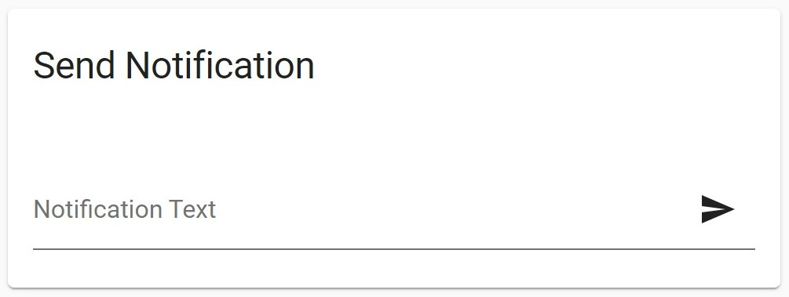

# Notify Card for Lovelace/Home Assistant

[](https://buymeacoffee.com/bernikr)
[](https://t.me/bernikr)

This simple card allows you to notify any notification service manually from the dashboard.



## Install
### Install via HACS
1. Go to the "Frontend"-tab in HACS
2. Click on "Explore & Add Repositories"
3. Search for `Notify Card`
5. Click "Install this Repository in HACS"

### Manual install
1. Copy the `notify-card.js` file to your `config/www` folder
2. Add a reference in the resoruce config:

```
resources:
  - url: /local/notify-card.js
    type: module
```

## Config
Example config:

```
type: 'custom:notify-card'
target: living_room_tv
label: Notify TV
card_title: Send Notification
notification_title: 'New Notification'
```

- `target` is the name of the notify-service that should get called without the `notify.` domain. (For `notify.notify` put in `notify`, for `notify.telegram` put in `telegram`, etc. If your service is not under the `notify.` domain, use the full service name, example: `script.notify_tv`)
- `label` is optional and controlls the placeholder text
- `card_title` is optional and controlles the card title
- `notification_title` is optional and is the title that gets sent with the notification

You can also specify multiple notification services like this:

```
type: 'custom:notify-card'
target:
- living_room_tv
- notify
```

If you want a textfield to set the notification title with every message you can configure it like this:
```
type: 'custom:notify-card'
target: living_room_tv
notification_title:
  input:
```

If you want to change the label of the title textfield you can do that in the input parameter:
```
type: 'custom:notify-card'
target: living_room_tv
notification_ title:
  input: 'Put Title here'
```

If your notification service requires additional data (e.g. Alexa) you can include it like this:
```
type: 'custom:notify-card'
target: alexa_media_living_room
data:
  type: announce
```

If your want to use `tts.google_translate_say`, include an entity like this:
```
type: 'custom:notify-card'
target: tts.google_translate_say
entity: media_player.google_nest_mini
```

