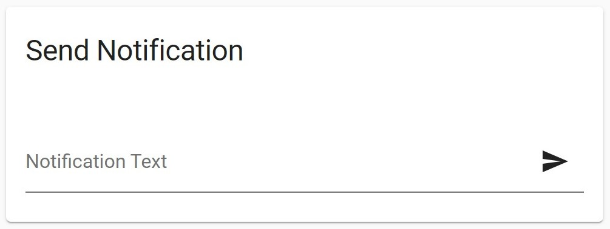

# Notify Card for Lovelace/Home Assistant

[](https://buymeacoffee.com/bernikr)
[](https://t.me/bernikr)

This simple card allows you to notify any notification service manually from the dashboard.



## Install
### Install via HACS
1. Go to the "Frontend"-tab in HACS
2. Click on "Explore & Add Repositories"
3. Search for `Notify Card`
5. Click "Install this Repository in HACS"

### Manual install
1. Copy the `notify-card.js` file to your `config/www` folder
2. Add a reference in the resource config:

```
resources:
  - url: /local/notify-card.js
    type: module
```

## Config
Example config:

```
type: 'custom:notify-card'
label: Notify TV
card_title: Send Notification
notification_title:
  input: Title
action: notify.living_room_tv
data:
  message: "{{ msg }}"
  title: "{{ title }}"
```

- `action` is the name of the action (service) to be called
- `data` is used to define the data that gets passed to the action. Any data can be entered here and home assistant templates are supported. (with `msg` and `title` as variables for the entered text and `user` for the current user object)
- `label` is optional and controls the placeholder text
- `card_title` is optional and controls the card title
- `notification_title` is optional and can be used as a second textfield

Minimal config:

```
type: 'custom:notify-card'
action: notify.living_room_tv
data:
  message: "{{ msg }}"
```

For services that require an entity as a target:

```
type: 'custom:notify-card'
action: tts.google_say
data:
  message: "{{ msg }}"
target:
  entity_id: media_player.nestmini_living_room
```

If you want a textfield to set the notification title with every message you can configure it like this:
```
...
type: 'custom:notify-card'
action: notify.living_room_tv
data:
  message: "{{ msg }}"
  title: "{{ title }}"
notification_title:
  input:
```

If you want to change the label of the title textfield you can do that in the input parameter:
```
...
notification_ title:
  input: 'Put Title here'
```
